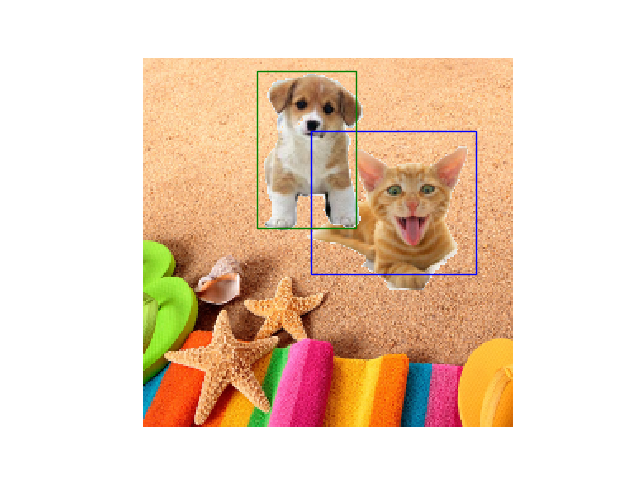
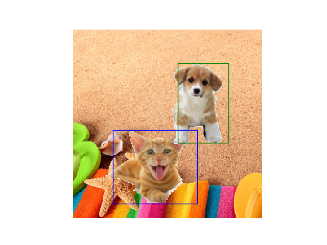

## where are  dog and cat ?

*  Inspired by YOLO, CNN could not only make classification, it could be used to detect the object position.
*  Here is the case that we know what the object is in a picture, we just want to know where it is. 
*  In this network, we could the detect the positions of a cat and also a dog in the picture, you could add any more objects you want, like eyes,nose, mouth, ears in a face to make it a face landmarker.

